# 📈 Paper Trading System

A modular, TypeScript-based automated paper trading system that integrates with TwelveData for real-time market data and Alpaca's Paper Trading API for simulated trades. Built for event-driven strategy execution with comprehensive risk management and performance tracking.

## 🚀 Features

- **Real-time Market Data**: WebSocket integration with TwelveData for live price feeds
- **Paper Trading**: Safe simulation using Alpaca's Paper Trading API
- **Modular Architecture**: Clean separation of concerns with 9 core services
- **Risk Management**: Built-in position sizing, daily loss limits, and drawdown protection
- **Multi-Strategy Support**: Run up to 9 independent trading strategies simultaneously
- **Comprehensive Logging**: Structured logging with different levels and module tracking
- **Health Monitoring**: Real-time system health checks and performance metrics
- **Type Safety**: Full TypeScript implementation with strict type checking

## 🏗️ Architecture

### Core Services

| Service | Purpose | Key Features |
|---------|---------|--------------|
| **HistoricalCache** | In-memory candle data management | TTL-based expiration, automatic trimming |
| **WebSocketClient** | Real-time data streaming | Auto-reconnection, error handling |
| **StreamRouter** | Event distribution | Pub-sub pattern, module tracking |
| **StrategyRunner** | Strategy lifecycle management | Multi-strategy support, enable/disable |
| **TradeOrchestrator** | Signal processing & risk management | Risk checks, PnL tracking |
| **PositionTracker** | Position management | Real-time PnL, position sizing |
| **TradeManager** | Order execution | Error handling, trade validation |
| **AlpacaClient** | Broker integration | Paper trading API integration |
| **Logger** | System observability | Structured logging, performance tracking |

### Data Flow

```
TwelveData WebSocket → StreamRouter → StrategyRunner → TradeOrchestrator → Alpaca API
                                    ↓
HistoricalCache ← REST API ← DataManager
```

## 📦 Installation

### Prerequisites

- Node.js 18+ 
- TypeScript 5.2+
- TwelveData API key
- Alpaca Paper Trading API credentials

### Setup

1. **Clone the repository**
   ```bash
   git clone <repository-url>
   cd PaperTradingSystem
   ```

2. **Install dependencies**
   ```bash
   npm install
   ```

3. **Configure environment variables**
   ```bash
   cp .env.example .env
   ```

   Edit `.env` with your API keys:
   ```env
   # Required API Keys
   TWELVEDATA_API_KEY=your_twelvedata_api_key
   ALPACA_API_KEY=your_alpaca_api_key
   ALPACA_API_SECRET=your_alpaca_api_secret

   # Optional Configuration
   LOG_LEVEL=INFO
   TRADING_SYMBOLS=AAPL,MSFT,GOOGL,TSLA
   TRADING_INTERVALS=1m,5m,15m
   MAX_POSITION_SIZE=10000
   MAX_DAILY_LOSS=1000
   MAX_DRAWDOWN=0.1
   ```

4. **Build the project**
   ```bash
   npm run build
   ```

## 🚀 Usage

### Development Mode
```bash
npm run dev
```

### Production Mode
```bash
npm start
```

### Available Scripts

| Command | Description |
|---------|-------------|
| `npm run dev` | Start in development mode with ts-node |
| `npm start` | Start in production mode |
| `npm run build` | Compile TypeScript to JavaScript |
| `npm test` | Run test suite |
| `npm run lint` | Run ESLint |
| `npm run format` | Format code with Prettier |

## 🔧 Configuration

### Environment Variables

| Variable | Required | Default | Description |
|----------|----------|---------|-------------|
| `TWELVEDATA_API_KEY` | ✅ | - | TwelveData API key |
| `ALPACA_API_KEY` | ✅ | - | Alpaca API key |
| `ALPACA_API_SECRET` | ✅ | - | Alpaca API secret |
| `LOG_LEVEL` | ❌ | `INFO` | Logging level (DEBUG, INFO, WARN, ERROR, FATAL) |
| `TRADING_SYMBOLS` | ❌ | `AAPL,MSFT,GOOGL,TSLA` | Comma-separated symbols |
| `TRADING_INTERVALS` | ❌ | `1m,5m,15m` | Comma-separated timeframes |
| `MAX_POSITION_SIZE` | ❌ | `10000` | Maximum position size in USD |
| `MAX_DAILY_LOSS` | ❌ | `1000` | Maximum daily loss in USD |
| `MAX_DRAWDOWN` | ❌ | `0.1` | Maximum drawdown as decimal |

### Strategy Configuration

Strategies are configured via environment variables or the `STRATEGY_CONFIG` JSON string:

```json
[
  {
    "name": "EMAConfluence",
    "symbols": ["AAPL", "MSFT"],
    "intervals": ["5m", "15m"],
    "enabled": true,
    "parameters": {
      "fastEma": 9,
      "slowEma": 21,
      "rsiPeriod": 14
    }
  }
]
```

## 📊 Monitoring

### Health Checks

The system performs automatic health checks every 30 seconds, monitoring:

- WebSocket connection status
- Active strategies
- Open positions and PnL
- Cache performance
- Risk metrics

### Logging

Structured logging with different levels:

```typescript
import { createModuleLogger } from './utils/logger';

const logger = createModuleLogger('MyStrategy');

logger.info('Strategy initialized', { symbols: ['AAPL'] });
logger.debug('Processing candle', { price: 150.25 });
logger.warn('Low confidence signal', { confidence: 0.3 });
logger.error('Trade failed', error, { symbol: 'AAPL' });
```

### Performance Metrics

- **Cache Hit Rate**: Historical data cache performance
- **Signal Quality**: Strategy signal confidence distribution
- **Trade Success Rate**: Order execution success rate
- **Risk Metrics**: Daily PnL, drawdown, position exposure

## 🛡️ Risk Management

### Built-in Protections

- **Daily Loss Limits**: Automatic trading halt on daily loss threshold
- **Position Size Limits**: Maximum position value per symbol
- **Drawdown Protection**: Stop trading on maximum drawdown breach
- **Signal Quality Filtering**: Minimum confidence thresholds
- **Duplicate Position Prevention**: Avoid multiple positions per symbol

### Risk Metrics

```typescript
const riskMetrics = tradeOrchestrator.getRiskMetrics();
// {
//   dailyPnL: -250.50,
//   maxDailyLoss: 1000,
//   maxPositionSize: 10000,
//   maxDrawdown: 0.1,
//   currentDrawdown: 0.025
// }
```

## 🔌 Extending the System

### Adding New Strategies

1. **Implement the Strategy interface**:
   ```typescript
   import { Strategy, Candle, TradeSignal } from '../types';

   export class MyStrategy implements Strategy {
     name = 'MyStrategy';
     symbols = ['AAPL'];
     intervals = ['5m'];
     enabled = true;

     async initialize(): Promise<void> {
       // Setup strategy
     }

     async onCandle(candle: Candle): Promise<TradeSignal | null> {
       // Generate signals
       return {
         symbol: candle.symbol,
         direction: 'LONG',
         confidence: 0.8,
         strategy: this.name,
         timestamp: Date.now()
       };
     }

     async cleanup(): Promise<void> {
       // Cleanup resources
     }
   }
   ```

2. **Register the strategy**:
   ```typescript
   import { strategyRunner } from './engine/StrategyRunner';
   import { MyStrategy } from './strategies/MyStrategy';

   const strategy = new MyStrategy();
   await strategyRunner.registerStrategy(strategy);
   ```

### Adding New Data Sources

1. **Create a new data client**:
   ```typescript
   import { Candle } from '../types';

   export class NewDataClient {
     async connect(): Promise<void> {
       // Connect to data source
     }

     async subscribe(symbols: string[]): Promise<void> {
       // Subscribe to symbols
     }

     onData(callback: (candle: Candle) => void): void {
       // Handle incoming data
     }
   }
   ```

2. **Integrate with StreamRouter**:
   ```typescript
   import { streamRouter } from './data/twelvedataClient/streamRouter';

   dataClient.onData((candle) => {
     streamRouter.notify(candle.symbol, candle.interval, candle);
   });
   ```

## 🧪 Testing

### Running Tests
```bash
npm test
```

### Test Structure
- **Unit Tests**: Individual component testing
- **Integration Tests**: Service interaction testing
- **Strategy Tests**: Strategy logic validation
- **Risk Tests**: Risk management validation

## 🚀 Deployment

### Docker Deployment

```dockerfile
FROM node:18-alpine

WORKDIR /app
COPY package*.json ./
RUN npm ci --only=production

COPY dist ./dist
COPY .env ./

EXPOSE 3000
CMD ["npm", "start"]
```

### Environment-Specific Configs

```bash
# Development
npm run dev

# Production
NODE_ENV=production npm start

# Docker
docker build -t paper-trading-system .
docker run -p 3000:3000 paper-trading-system
```

## 📈 Performance Optimization

### Caching Strategy
- **Historical Data**: TTL-based cache with automatic trimming
- **Strategy State**: In-memory state management
- **API Responses**: Cached broker responses

### Memory Management
- **Stream Processing**: Event-driven architecture
- **Position Tracking**: Efficient data structures
- **Log Rotation**: Automatic log cleanup

## 🔒 Security

### API Key Management
- Environment variable storage
- No hardcoded credentials
- Secure API key rotation

### Data Protection
- No sensitive data logging
- Encrypted API communications
- Secure WebSocket connections

## 🤝 Contributing

1. Fork the repository
2. Create a feature branch
3. Implement your changes
4. Add tests
5. Submit a pull request

### Code Style
- TypeScript strict mode
- ESLint configuration
- Prettier formatting
- Comprehensive error handling

## 📄 License

MIT License - see LICENSE file for details

## 🆘 Support

### Common Issues

**WebSocket Connection Issues**
- Check TwelveData API key validity
- Verify network connectivity
- Review WebSocket URL configuration

**Trade Execution Failures**
- Verify Alpaca API credentials
- Check account permissions
- Review order parameters

**Strategy Performance**
- Monitor signal quality metrics
- Review risk management settings
- Check market data quality

### Getting Help

- **Issues**: Create GitHub issues for bugs
- **Discussions**: Use GitHub Discussions for questions
- **Documentation**: Check inline code documentation

---

**⚠️ Disclaimer**: This is a paper trading system for educational purposes. Never use real money without proper testing and risk management.
All things strat related for stock trading, a methodology created by Rob Smith.  Knowledge should be collaborative and shared, not behind a paid wall.  Definitely a work in progress.  Not financial advice.  

Want to contribute?  Let me know ask for collaborator request.  Twitter @rickyzane85

# Table of Contents
------
- [Overview](#overview)
    + [Candlestick Overview](#candlestick-overview)
    + [STRAT PART 1 - Candles and Pricing Action](#strat-part-1---candles-and-pricing-action)
    + [STRAT PART 2 - Other Factors](#strat-part-2---other-factors)
    + [START PART 3 - Actionable Signals](#start-part-3---actionable-signals)
    + [STRAT PART 4 - Misc](#strat-part-4---misc)
- [Detail](#detail)
  * [Cheat Sheets](#cheat-sheets)
  * [Acronyms and Terms](#acronyms-and-terms)
  * [Social Media](#social-media)
  * [Links](#links)
  * [Tools](#tools)


# Overview
------
TheSTRAT is a trading method developed by Rob Smith (@RobInTheBlack).  

### Candlestick Overview
Before beginning you have to have a basic understanding of candlesticks.  Candle sticks have 5 basic parts.  
* WICKS
  * 1 - Top wick / high / very top of the candle
    * The highest price the stock trading during the given time frame of the candlestick
  * 2 - Bottom wick / low / very bottom of the candle
    * The lowest price the stock trading during the given time frame of the candlestick
* FILL
  * 3 - Open
    * The price of the stock at the open of the given time frame (top or bottom of the fill depending on the color, more below)
  * 4 - Close
    * The price of the stock at the close of the given time frame (top or bottom of the fill depending on the color, more below)
  * 5 - Color
    * Green / Hollow / Empty
      * 3/4 The open was lower than the close, it opened at the bottom and closed at the top (price went up)   
    * Red / Black / Full
      * 3/4 The open was higher than the close, it opened at the bottom and closed at the top (price went down)
* Example 
  * 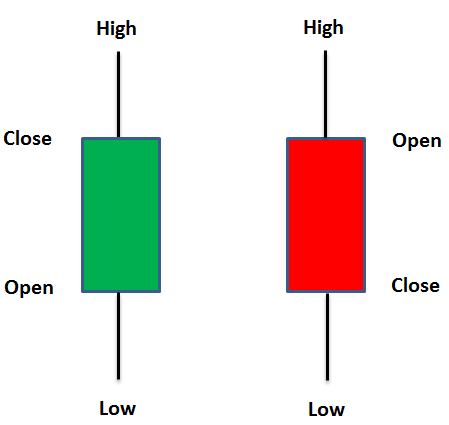


### STRAT PART 1 - Candles and Pricing Action
  * 1 Candle
    * Names: 
      * 1 Candle / Inside Bar / Inside Action / Consolidation / Sideways
    * Technical:
      * Occur when the current candle falls completely within the prior candle
    * Meaning:
      * Balance, equilibrium, buyers and sellers agree on price, no one is in control, trying to determine where price is going next
    * Detail:
      * Never trade a one bar, wait for the consolidation to stop then it's time to get into a trade
    * Example
      * 
  * 2 Candle
    * Names: 
      * 2 Candle / Directional Bar / 2 Down / 2 Up
    * Technical: 
      * Occur when the current candle takes out one side of the prior candle
        * A 2 down means it took out the previous candle's low, but failed to take out the high
        * A 2 up means it took out the previous candle's high, but failed to take out the low
    * Meaning: 
      * Sellers are selling it down or buyers are buying it up but not both, a 2 can turn into a 3, but never a 1 
    * Action: 
      * The market trades in the direction of the most 2's, but only trade 2's with continuation
    * Example: 
      * 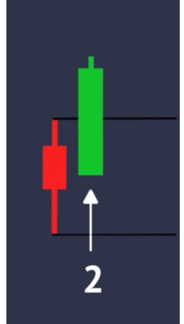 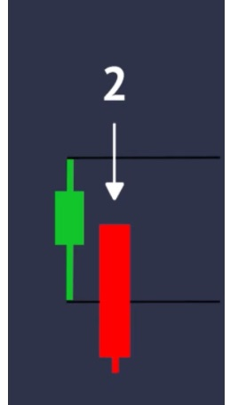
  * 3 Candle
    * Names: 
      * 3 Candle / Outside Bar / Discovery Candle / Mother Bar
    * Technical: 
      * Occur when the current candle takes out both sides of the prior candle
    * Meaning: 
      * Price discovery starting over, buyers willing to buy it up, sellers willing to buy it down, choppiness
    * Action: 
      * Never trade a mother bar, price discovery is happening, wait for further confirmation one way or anther
    * Example:
      * 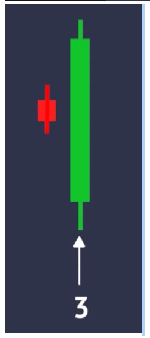


### STRAT PART 2 - Other Factors
* Time Frame Continuity
  * Price direction is best determined when looking at multiple time frames rather than lagging indicators or moving averages
  * When all time frames point in the same direction in either direction, or Full Time Frame Continuity, is the ideal trading situation
  * Example: 
    * 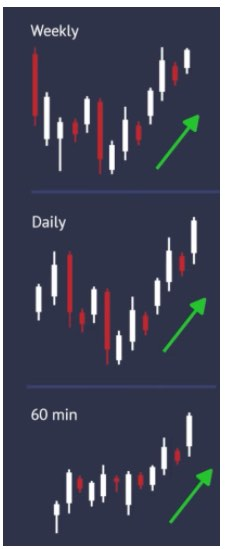 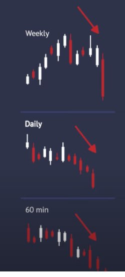
* Broadening Formations 
  * Simplest explanation is = it's a compound 3 bar
    * Lower lows and higher highs
    * Can draw this anywhere on any time line
    * Just pick a high, draw the line to a higher high
    * Pick a low, draw a line to a lower low
    * Bars should be more FLAT than not, otherwise mostly inside action (which is fine, but if you are looking for trends start flatter)
  * Increasing price volatility and diagrammed as two diverging trend lines, one rising and one falling
  * It usually occurs after a significant rise, or fall, in pricing action
  * It is identified on a chart by a series of higher pivot highs and lower pivot lows.
  * Directional bars and outside bars that fit into a triangle and ultimately lead to reversals or expansions and present trading opportunities
  * Picture: 
    * 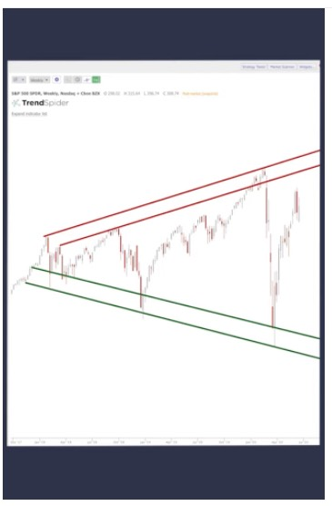

### START PART 3 - Actionable Signals
* Hammer
  * Candle that looks like a "hammer"
  * Little to no top wick, open and close are very close to the top of the wick, 75% of the candle is mostly wick at the bottom
  * Action: 
    * Entry as soon as the next candle breaks above the top, or top, wick of the previous hammer candle
  * Picture:
    *  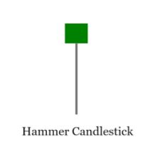
* Shooter / Shooting Star
  * Candle that looks like a "shooter" / upside down hammer
  * Little to no bottom wick, open and close are very close to the bottom of the wick, 75% of the candle is mostly wick at the top
  * Action: 
    * Entry as soon as the next candle breaks below the bottom, or bottom wick, of the previous shooter candle
  * Picture: 
    * 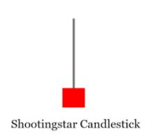
* Inside Bar
  * Inside bar (explained above)
  * Action: 
    * After price is done consolidating it will break up or down, take the break at the top or the bottom of the previous inside candle depending on which way it goes  

### STRAT PART 4 - Misc
* PMG - Pivot Machine Gun
  * A very fast moving upwards or downwards candles taking out previous highs or previous lows
  * As the prior candles are "taken out" it causes those investors to go the other way, reinforcing the direction of the bar even more taking out even more highs or lows
  * Picture: 
    * 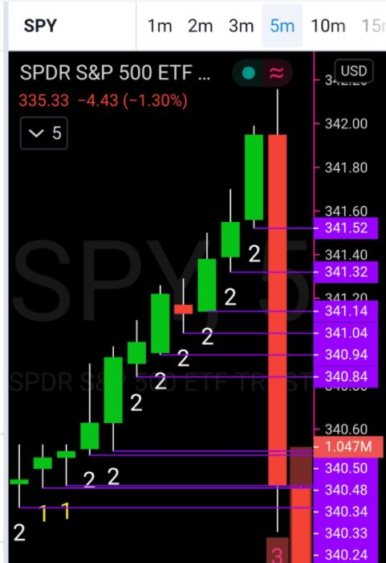
* TTO - Triangle They Out
  * Inside action on a larger timeframe
  * As consolidation is happening, things will get "tighter" toward a point and eventually break out up or down and go fast
  * Picture: 
    * 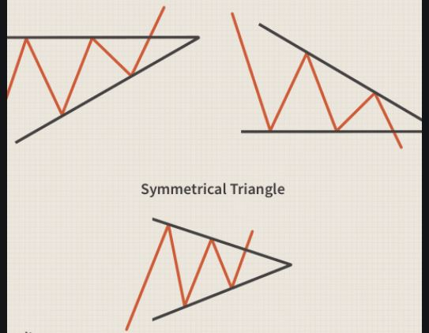


# Detail
------
## Cheat Sheets
#### STRAT Cheat Sheet1
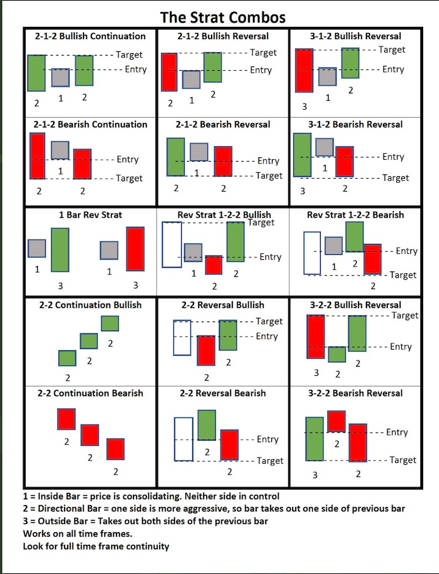

#### STRAT Cheat Sheet2
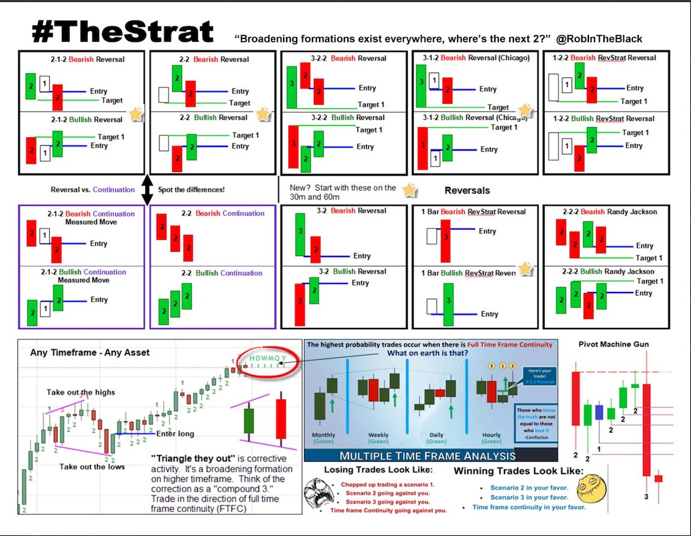

#### Candlestick Cheat Sheet
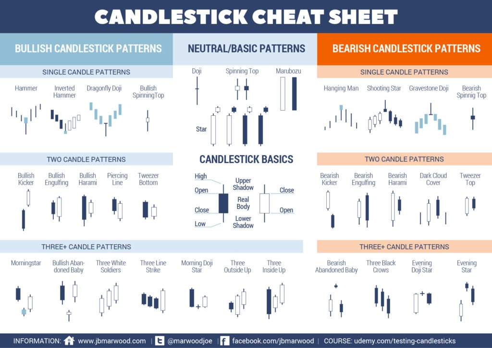

#### Kicking Patterns
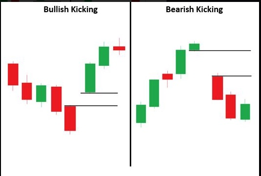


## Acronyms and Terms
|TERM     |MEANING                                       |DESCRIPTION                                                                                                             |
|---------|----------------------------------------------|------------------------------------------------------------------------------------------------------------------------|
|15'r/15er|15 min Candle                                 |Candle on 15 min interval                                                                                               |
|5'r/5er  |5 min Candle                                  |Candle on 5 min interval                                                                                                |
|60'r/60er|60 Min Candle                                 |Candle on 60 min interval                                                                                               |
|AH       |After Hours                                   |Stock trading after the market closes 4PM EST                                                                           |
|APTR     |Average Percentage True Range                 |indicator to measure the volatility by percentage of a stock with price being neutral                                   |
|AS       |Actionable Signal                             |A "signal" to take an action                                                                                            |
|ATR      |Average True Range                            |Volatility indicator -  a wedge or triangle shape of the recent candles                                                 |
|BF       |Broadening Formation                          |A compound 3 bar - higher highs - lower lows - subjectively drawn                                                       |
|BMO      |Before Market Opens                           |Usually a term used for when earnings come out in the AM before the market opens                                       |
|DTL      |Down trend line (magic lines)                 |Trending down on the magic broadening formation trendline                                                               |
|EMA      |Exponential moving Average                    |type of moving average that places a greater weight and significance on the most recent data points                     |
|EOD      |End of Day                                    |End of the stock trading day 4PM EST                                                                                    |
|EPS      |Earnings Per Share                            |A company's earnings per share outstanding                                                                              |
|ER       |Exhaustion Risk                               |Reached magnitude or price target or right at broadening formation line                                                 |
|ETH      |Extended trading hours                        |Trading that occures after the market close 4PM                                                                         |
|FTC/FTFC |Full Time Frame Continuity                    |All time frames "match" - they are all up or down                                                                       |
|GAP      |A gap in stock price (missing candles         |A stock opens and GAPS up or down and there is no fill in between.  Missing by or sales may lead to opportunities for that gap to "fill" quickly when things reverse.                                                                         |
|HAMMER   |Candle that looks like a hammer or T          |Actionable signal to a move upward                                                                                      |
|HCS      |Hammer Counter Shooter                        |Hammer that counters/turns into a shooter                                                                               |
|HOD      |High of Day                                   |The high stock price of the day                                                                                         |
|ID       |Inside Day                                    |Whole day is inside candle from prior day                                                                               |
|IW       |Inside Week                                   |Whole week is inside candle from prior week                                                                             |
|LOD      |Low of Day                                    |The low stock price of the day                                                                                          |
|MAG      |Magnitude                                     |How far a price run is or the price target                                                                              |
|MM       |Market Maker                                  |Company or an individual that quotes both a buy and a sell price hoping to make a profit on the bid–ask spread          |
|MOMO     |Momentum                                      |Usually momentum in a direction                                                                                         |
|MTFA     |Multiple Time Frame Analysis                  |Look at more than one interval                                                                                          |
|MTG      |Mind The Gap                                  |Rob Smith saying look for the GAP on these it might fill                                                                |
|NATH     |New All Time High                             |Stock made a new all time high                                                                                          |
|NHOD     |New High of Day                               |A new high stock price of the day                                                                                       |
|NLOD     |Low of Day                                    |A new low stock price of the day                                                                                        |
|ORB      |Opening Range Break                           |when a price breaks above or below the previous candle high or low from the open used on 15, 30, or 60 mins from open   |
|ORH      |Opening Range High                            |the high price of a stock from the opening range 15/40/60 mins from open breaking to the upside                         |
|ORL      |Opening Range Low                             |the low price of a stock from the opening range 15/30/60 mins from open breaking to the downside                        |
|PDT      |Pattern Day Trader                            |Traders who trade 4+ day trades over the span of 5 business days on a margin account get their account flagged with this|
|PM       |PreMarket                                     |Stock trading before the market opens 9:30AM EST                                                                        |
|PMG      |Pivot Machine Gun                             |Trend pivots the other way taking out several highs or lows of other candles                                            |
|SHOOTER  |Candle that looks like a gun or upside down T |Actionable signal to a move downward                                                                                    |
|SMA      |Simple Moving Average                         |moving average calculated by adding recent prices and then dividing that figure by the number of time periods           |
|The Flip |New candle                                    |Flip of the time interval to produce a new candle                                                                       |
|TTO      |Triangle They Out                             |corrective pullback/activity - a wedge or triangle shape of the recent candles                                          |
|VWAP     |Volume Weighted Average Price                 |statistic used by traders to determine what the average price is based on both price and volume                         |
|WW       |Worth Watching                                |Keep an eye on a this stock                                                                                             |
|IN FORCE |A method/strategy is in force                 |Above the reversal / continuation entry to the upside and below the reversal / continuation entry to the downside       |
|LOTTO    |Lottery Ticket                                |Gamble play, risky but very rewarding, usually a fast expiry                                                            |


## Social Media
-----
### Youtube
* https://www.youtube.com/user/smithsintheblack
* https://www.youtube.com/user/ssabatino84
* https://www.youtube.com/channel/UCYllJ4eRU4wDVSbZ9pHIJKA

### Twitter
* @RobInTheBlack is the creator 	
* @LevJampolsky
* @AlexsOptions 	
* @TradeSniperSara
* @CyberDog2		
* @jam_trades  		
* @_JamesBradley__		
* @japor3		
* @WayoftheMaster7	
* @ADBYNOT		
* @chucknfones		
* @OptionizerSS
* @r3dpepsi		
* @Banker_L83		
* @R2DayTrades		
* @FranknBear 
* @StratDevilDog	
* @yogajen70		
* @toddjostendorf 		
* @ElaineBenes99 

## Links 

### News
* CNBC - premarket
  * https://www.cnbc.com/2021/06/18/stocks-making-the-biggest-moves-in-the-premarket-adobe-smith-wesson-orphazyme-more.html?&qsearchterm=premarket
* Fed Reserve Calendar & Events
  * https://www.federalreserve.gov/newsevents/calendar.htm
* Economic Calendar
  * https://research.investors.com/economic-calendar/
* Upcoming Earnings
  * https://www.earningswhispers.com/calendar
* Blog
  * https://acquirersmultiple.com/blog/
* Newsletter
  * https://litquidity.co/pages/newsletter

### Analysis
* Marketwatch: upgrades & downgrades
  * https://www.marketwatch.com/tools/upgrades-downgrades
* Analyst Consensus
  * https://www.tipranks.com/
* Short Interest
  * https://www.marketwatch.com/tools/screener/short-interest
* Finviz Sector Tool
  * https://finviz.com/groups.ashx


## Tools

### Scripts
* TD Ameritrade Think of Swim Scripts
  * https://usethinkscript.com/threads/rob-smiths-the-strat-indicator-for-thinkorswim.3312/
* Trading View Scripts
  *  Just search for The Strat
  *  My personal script for free - actionable signals, colors, strategies, work in progress
     *  https://www.tradingview.com/script/PWJRC2Nt-Strat-Assistant/
  *  Others
     *  https://www.tradingview.com/script/0WOo54ab-Candle-Type-The-Strat/
     *  https://www.tradingview.com/script/idDydr1G-TheStratHelper/
     *  https://www.tradingview.com/script/9QtwuoHf-Timeframe-Continuity/

### Misc
* Good explanation of TheStrat
  * https://www.newtraderu.com/2019/02/13/what-do-we-know-to-be-true-about-price-action/
* StratFlix - great list of strat videos
  * https://drive.google.com/file/d/1-P-ADhAwqg30pzVSdqzJfprUks02eTu6/view
* Tons of free books
  * https://drive.google.com/drive/folders/1eIpH0RyJCGCQvhHZ8miP-DaGwU9bWqLb
  * https://www.marketgauge.com/TradingThe10OclockBulls.pdf
* Options Calculator
  * https://www.optionsprofitcalculator.com/
* Charting
  * https://www.tradingview.com/
* Automating Trades
  * https://ninjatrader.com/
* Market / Timeframe Alerts
  * http://mindtheflip.com/#

### Exchanges
* TD Ameritrade
  * https://www.tdameritrade.com/home.html
* E-Trade
  * https://us.etrade.com/home/welcome-back
* Webull
  * https://www.webull.com/center
* Interactive Brokers
  * https://www.interactivebrokers.com/en/home.php
* Robinhood
  * https://robinhood.com/us/en/
